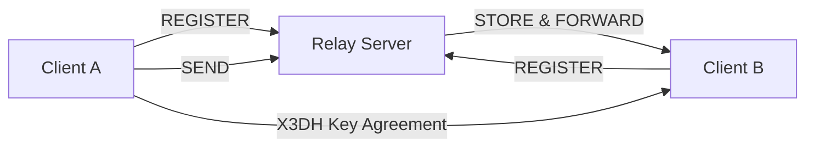

# Sibna Protocol

Comprehensive documentation for the Sibna secure messaging protocol, SDKs, and server components.

This README is generated from the repository sources (`docs/`, `core/`, `bindings/`, and `examples/`) and aims to provide an accurate, production-oriented overview suitable for a large project.

---

## Table of Contents
- Overview
- Key Features
- Architecture (Mermaid)
- Protocol Specification
  - Cryptographic Primitives
  - X3DH (Key Agreement)
  - Double Ratchet (Message Encryption)
- Relay Server Protocol (Wire Format)
- Core Components
  - `SecureContext`
  - `SessionManager`
  - Keystore & Persistence
- SDKs & Bindings
- Getting Started
  - Building the core (Rust)
  - Python bindings
  - Running the example
- Usage Examples
  - Python example (from `examples/hello_world.py`)
  - Rust snippet (using `core` API)
- Security Considerations
- Contributing
- License & Contact

---

**Overview**

Sibna is a secure, end-to-end encrypted, offline-capable messaging protocol and SDK set. It is designed to be production-ready and modular so it can be embedded into services, clients, and lightweight relay servers.

The implementation in this repository includes:
- A core cryptographic and session management library (`core/`) written in Rust.
- Relay server protocol documentation and a simple binary protocol design (`docs/relay_protocol.md`).
- Language bindings and SDKs (Python, JavaScript, Dart) under `bindings/` and `sibna-*` directories.
- Examples demonstrating client usage (`examples/hello_world.py`).

**Key Features**

- End-to-End Encryption using modern primitives (X25519, Ed25519, AES-256-GCM, SHA-256, HKDF).
- X3DH-style authenticated key agreement for initial session establishment.
- Double Ratchet for forward secrecy and post-compromise recovery.
- Offline-first design with a store-and-forward Relay Server model.
- Persistence of session state using `sled` (embedded KV store) for resilience.

**Architecture**

Below is a simplified architecture diagram. You can render this using any Markdown renderer that supports Mermaid (GitHub renders Mermaid in markdown files if enabled) or external Mermaid live editors.



This diagram intentionally keeps the relay server in a metadata-only role: it forwards and stores messages but does not decrypt message content.

**Protocol Specification (summary)**

Source documents in `docs/protocol/specs.md` describe the protocol in detail. The following summarizes the most important points found in the codebase and docs.

- Cryptographic Primitives
  - Curve: X25519 (ECDH) for key agreement.
  - Signatures: Ed25519 for identity key signing.
  - AEAD: AES-256-GCM for authenticated encryption of message payloads.
  - Hash: SHA-256. KDF: HKDF.

- X3DH (Key Agreement)
  - The initial shared secret is derived from a concatenation of DH outputs between identity, signed pre-key, one-time pre-key and ephemeral keys.
  - The KDF output becomes the Root Key for the Double Ratchet.
  - This gives forward secrecy (via ephemeral keys) and authentication (via signed pre-keys and identity keys).

- Double Ratchet
  - Messages are encrypted using a symmetric ratchet (chain keys and message keys derived with HMAC).
  - When a new ephemeral DH public key is observed, parties perform a DH ratchet and derive a new root key and reset chain keys.
  - Header information (ratchet counters) is protected to reduce metadata leakage.

Detailed formulas and method names are present in `docs/protocol/specs.md`. The implementation follows a stateful session model with serialization/deserialization of session state for persistence.

**Relay Server Protocol (wire format summary)**

The `docs/relay_protocol.md` file documents a small binary protocol used for store-and-forward messaging. Important notes:

- All commands are length-prefixed; many fields are fixed-size (32-byte public keys) and length encoded (4 byte big-endian lengths).
- Commands include `REGISTER (0x01)`, `SEND (0x02)`, and `FETCH (0x03)`.
- Relay stores undelivered messages (V1: in-memory/disk), but it cannot read encrypted payloads.

Wire-format examples (as documented):

- REGISTER: 1-byte command (0x01) followed by 32-byte PublicKey.
- SEND: 1-byte command (0x02) | RecipientPubKey (32 bytes) | MessageLength (4 bytes BE) | MessageBlob
- FETCH: 1-byte command (0x03) and server responds with Count (4 bytes BE) and repeated [SenderPubKey (32) | Length (4) | Blob].

**Core Components (from `core/`)**

- `SecureContext` — high-level API to manage keystore, sessions, randomness, and configuration. It opens a `sled` DB, creates keystore and session manager, and exposes methods to create sessions, perform handshakes, encrypt/decrypt messages, and manage keys.

- `SessionManager` — keeps in-memory cache of sessions and persists session state into the `sled` tree named `sessions`. It implements `create_session`, `get_session`, `save_session`, and `remove_session`.

- `DoubleRatchetSession` (internal) — implements stateful ratchet logic including `serialize_state` and `deserialize_state` for persistence.

The core module uses `sled` for persistent state and `parking_lot` for synchronization. Error types and results are re-exported from `core/src/error.rs`.

**SDKs & Bindings**

This repository contains bindings and packaging for multiple languages. Notable directories:

- `bindings/python/` — Python packaging and `setup.py` to build/install a Python extension that wraps the Rust core.
- `sibna-js/` and `sibna-dart/` — scaffolding for other SDKs.

Refer to each binding folder for platform-specific build & installation instructions.

**Getting Started**

Prerequisites:

- Rust toolchain (stable) with `cargo`.
- Python 3.8+ for Python bindings (if using Python SDK).
- Optional: `cargo` toolchain and `maturin` if building Python wheels from Rust.

Build core (native Rust library):

```powershell
# From repository root
cargo build --release
```

Python bindings (editable install):

```powershell
cd bindings/python
pip install -e .
```

Running the example (Python):

```powershell
python examples/hello_world.py
```

This example demonstrates client initialization, background engine start, key registration to the server, and sending a message.

**Usage Examples**

Python (from `examples/hello_world.py`):

```python
from sibna import Client
import time

alice = Client("alice_prod", server_url="http://localhost:8000")
alice.start()
alice.register()
alice.send("bob_prod", "Hello, Bob! This is using the Sibna SDK.")
time.sleep(2)
alice.stop()
```

Rust snippet (high level) — using `core` crate types (see `core/src/lib.rs`):

```rust
use core::Config;
use core::SecureContext;

let cfg = Config::default();
let ctx = SecureContext::new(cfg).expect("create ctx");
let peer = b"bob";
let handle = ctx.create_session(peer).expect("create session");
// perform handshake, encrypt/decrypt via `ctx.perform_handshake`, `ctx.encrypt_message`, `ctx.decrypt_message`
```

**Diagrams & Images**

This README includes Mermaid diagrams for architecture. If you want rendered PNG/SVG assets for README display on GitHub releases or documentation pages, you can:

1. Use the Mermaid CLI (npm `@mermaid-js/mermaid-cli`) to render diagrams to SVG/PNG.
2. Add generated images to `docs/assets/` and reference them in the README.

Example Mermaid CLI usage:

```powershell
npx @mermaid-js/mermaid-cli -i diagrams/architecture.mmd -o docs/assets/architecture.svg
```

**Security Considerations**

- The relay server sees metadata (who is talking to whom) but not message content.
- Key material protection is critical: keep identity private keys offline or in secure hardware when possible.
- The repository implements Forward Secrecy and Post-Compromise Security primitives, but production deployments must consider secure key rotation, secure storage, and hardened server operation.

**Contributing**

Contributions are welcome. Suggested workflow:

1. Fork the repository.
2. Create a feature branch.
3. Run tests and checks (`cargo test`, `pytest` if Python tests exist).
4. Open a PR with a clear description and tests for new behavior.

Please follow the code patterns already present in `core/` and keep changes minimal and focused.

**License & Contact**

Include licensing information here (e.g., MIT, Apache-2.0). If this repository has an existing license file, copy its name and contents here.

For questions, open an issue or contact the maintainers via the GitHub repository: `https://github.com/F2fX4553/sibnav5_pro`.

---

Notes
- This README is based on source files in `docs/`, `core/`, `examples/`, and `bindings/`. It is written to be factual and reflect the implementation in the repository. For design rationale and deeper crypto background, refer to `docs/protocol/specs.md`.
